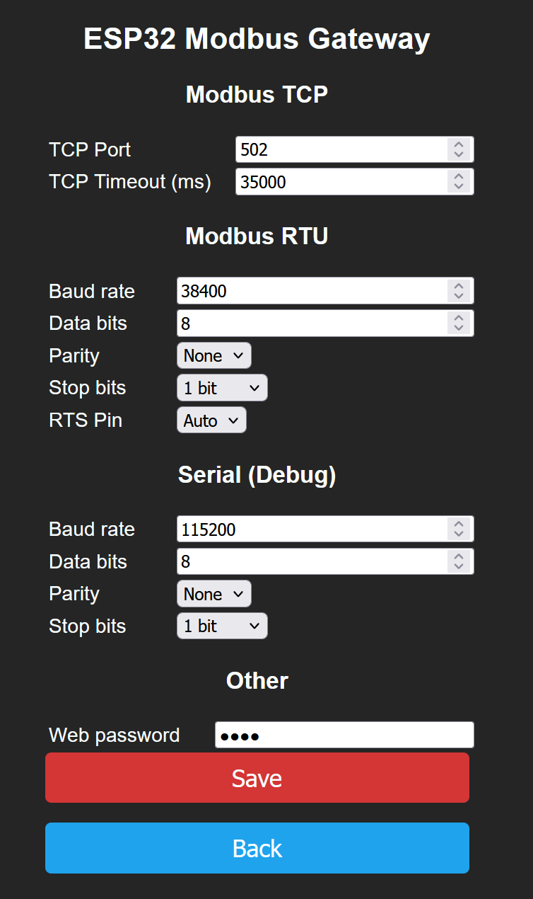

# ESP32 Modbus RTU/TCP Gateway

A generic firmware for an ESP32 to be used as a Modbus TCP/IP gateway for any Modbus RTU device. Bridges Modbus TCP clients (via WiFi) to Modbus RTU devices (via RS485).

## Prerequisites

- [PlatformIO](https://platformio.org/) CLI or VSCode extension
- ESP32 board (ESP32 Dev Module, ESP32-POE, Wemos D1 Mini ESP32, or similar)
- RS485 transceiver (e.g., XY-017 with automatic flow control)
- Modbus RTU device(s) on the RS485 bus

## Build Environments

| Environment | Board | RX/TX Pins | Log Level | Notes |
|-------------|-------|------------|-----------|-------|
| `esp32debug` | ESP32 Dev Module | Default Serial2 | DEBUG | Default, full debug output |
| `esp32release` | ESP32 Dev Module | Default Serial2 | WARNING | Release build, minimal logging |
| `olimex-poe` | ESP32-POE | RX=14, TX=5 | DEBUG | Custom UART pins for POE board |
| `d1mini` | Wemos D1 Mini ESP32 | Default Serial2 | DEBUG | Wemos D1 Mini variant |

## Build & Flash

```bash
# Build debug firmware
pio run -e esp32debug

# Build and upload debug firmware
pio run -e esp32debug -t upload

# Build and upload release firmware
pio run -e esp32release -t upload

# Monitor serial output
pio device monitor -b 115200
```

### Custom UART Pins

Override RX/TX pins via build flags for any board:

```bash
pio run -e esp32debug -t upload -- -DRX_PIN=16 -DTX_PIN=17
```

## First-Time Setup

1. Flash the firmware to the ESP32
2. On first boot, the ESP32 starts in **AP mode** (no WiFi credentials stored)
3. Connect to the `ESP32_XXXX` WiFi network — the captive portal opens automatically
4. Select your WiFi network and enter credentials
5. The ESP32 reboots and connects to your WiFi
6. Find the assigned IP address via serial monitor (115200 8N1)
7. Open `http://<esp-ip>/` in your browser

## Web Interface

All pages (except CSS and favicon) are protected by an optional admin password set in the Config page.

| Page | Route | Description |
|------|-------|-------------|
| **Home** | `/` | Main menu with links to all pages |
| **Status** | `/status` | ESP uptime, SSID, RSSI, MAC, IP, Modbus RTU & bridge message counts/errors |
| **Config** | `/config` | Configure TCP port, timeout, Modbus RTU parameters, debug serial, web password |
| **Debug** | `/debug` | Send arbitrary Modbus requests (read coils/inputs/holding registers) and view raw hex response |
| **Firmware Update** | `/update` | OTA firmware upload with optional MD5 checksum verification |
| **WiFi Reset** | `/wifi` | Erase stored WiFi credentials and reboot into AP mode |
| **Reboot** | `/reboot` | Restart the ESP32 |

### Configuration Parameters

| Parameter | Default | Range | Description |
|-----------|---------|-------|-------------|
| TCP Port | 502 | 1–65535 | Modbus TCP gateway port |
| TCP Timeout (ms) | 10000 | 100–60000 | Idle connection timeout |
| Modbus Baud Rate | 9600 | ≥1200 | RS485 bus baud rate |
| Modbus Data Bits | 8 | 5–8 | Serial data bits |
| Modbus Parity | None | None/Even/Odd | Serial parity |
| Modbus Stop Bits | 1 | 1/1.5/2 | Serial stop bits |
| Modbus RTS Pin | Auto | -1 or GPIO | RS485 direction control pin |
| Serial Baud Rate | 115200 | ≥1200 | Debug serial baud rate |
| Serial Data Bits | 8 | 5–8 | Debug serial data bits |
| Serial Parity | None | None/Even/Odd | Debug serial parity |
| Serial Stop Bits | 1 | 1/1.5/2 | Debug serial stop bits |
| Web Password | (none) | any | HTTP Basic Auth password for web UI |

Config changes are applied after an automatic reboot triggered by saving.

## Modbus TCP Usage

Connect any standard Modbus TCP client to the ESP32's IP address on port 502:

```
<esp-ip>:502
```

All slave IDs **1–247** are bridged to the Modbus RTU bus. All standard function codes are forwarded:
- 01 Read Coils
- 02 Read Discrete Inputs
- 03 Read Holding Registers
- 04 Read Input Registers
- 05 Write Single Coil
- 06 Write Single Register
- 15 Write Multiple Coils
- 16 Write Multiple Registers

The eModbus library handles the protocol conversion: TCP MBAP header is stripped, the request is sent as Modbus RTU with CRC, and the response is re-wrapped back to TCP.

## Hardware Wiring

### ESP32 + XY-017 TTL-RS485 (automatic flow control)


| ESP32 Pin | XY-017 Pin | Notes |
|-----------|-------------|-------|
| GPIO17 (TX2) | DI | UART2 TX → RS485 driver input |
| GPIO16 (RX2) | RO | UART2 RX ← RS485 receiver output |
| VCC (3.3V) | VCC | Power |
| GND | GND | Common ground |
| (optional) RTS GPIO | DE/RE | Direction control (if not using auto flow control) |

Default Serial2 pins: TX=GPIO17, RX=GPIO16. These can be changed per environment (see `olimex-poe` for an example).

## Over-The-Air (OTA) Updates

1. Navigate to **Firmware Update** in the web UI
2. Build the firmware: `pio run -e esp32release`
3. Select the generated `.pio/build/esp32release/firmware.bin` file
4. Optionally enter the MD5 checksum for integrity verification
5. Click **Upload** — the ESP32 reboots automatically after a successful update

## Debug Page

The Debug page lets you send arbitrary Modbus RTU requests directly from the web UI:

- **Slave ID**: Target device address (1–247)
- **Function**: Read Coils (01), Read Discrete Inputs (02), Read Holding Registers (03), Read Input Registers (04)
- **Register**: Starting register address
- **Count**: Number of registers/coils to read

The response is displayed as raw hex bytes along with any eModbus library debug output.

## Build Configuration

Key build flags in `platformio.ini`:

| Flag | Purpose |
|------|---------|
| `-DENABLE_DEBUG` | Enable serial debug output (dbg/dbgln macros) |
| `-DLOG_LEVEL=LOG_LEVEL_DEBUG` | eModbus library log verbosity |
| `-DRX_PIN=14 -DTX_PIN=5` | Custom UART pins for RS485 |

## Screenshots

### Home


### Status


### Config



### Debug


## License

GNU General Public License v3. See [LICENSE](LICENSE).
